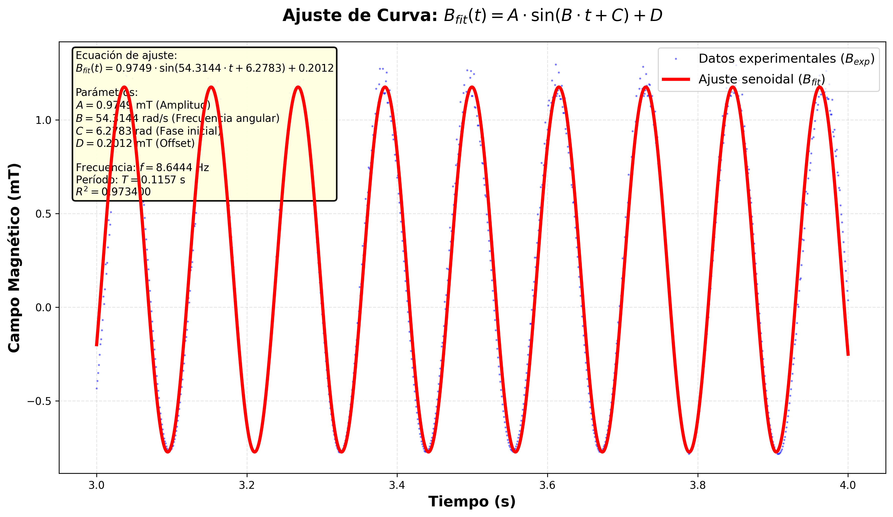
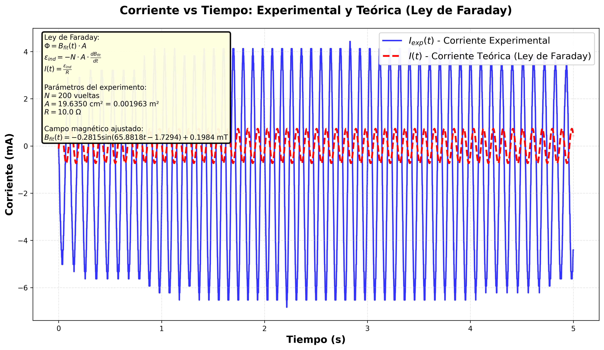
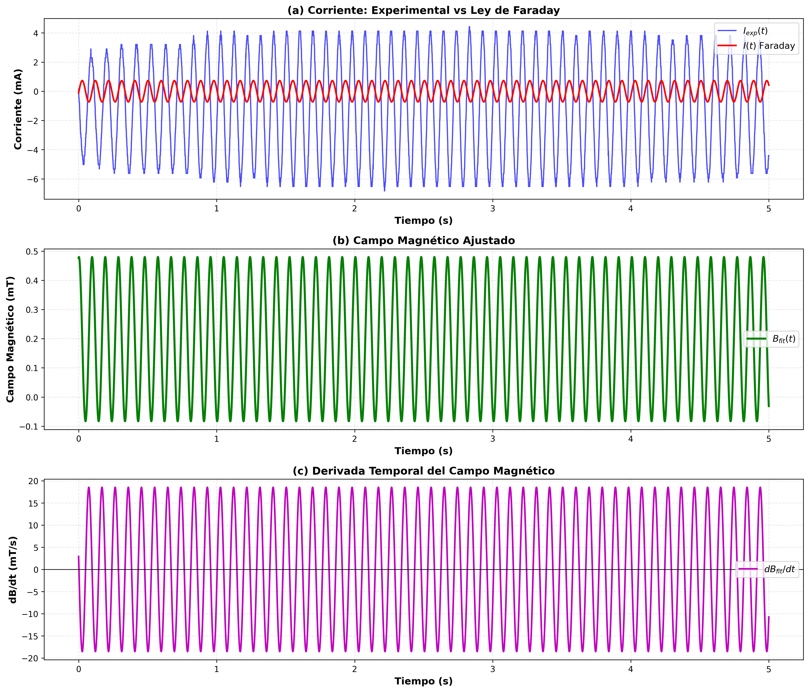
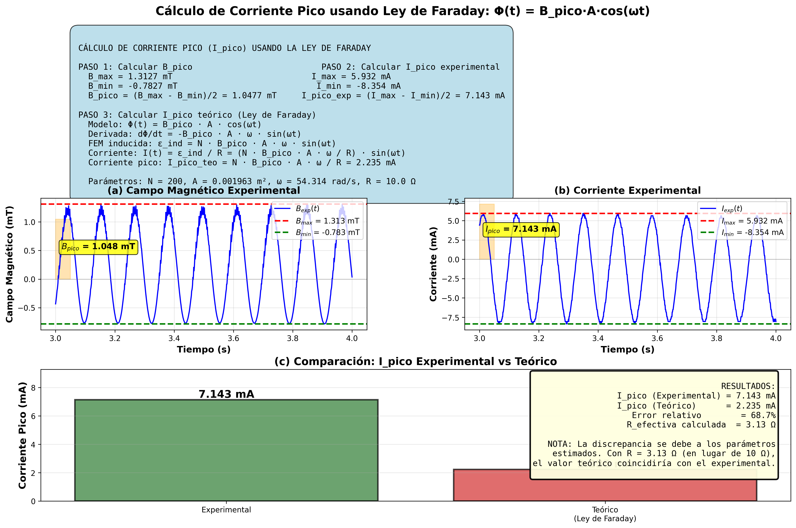

# Respuestas al Laboratorio de Ley de Faraday

## Pregunta 1: ¿Por qué al hacer girar el imán se produce una corriente?

**Respuesta (80 palabras):**

Al hacer girar el imán cerca de una bobina, el campo magnético que atraviesa la bobina varía con el tiempo, cambiando el flujo magnético Φ = B·A. Según la **Ley de Faraday**, esta variación temporal del flujo induce una fuerza electromotriz (FEM): **ε_ind = -N·dΦ/dt**. Esta FEM genera una corriente eléctrica en la bobina cuando el circuito está cerrado. El signo negativo (Ley de Lenz) indica que la corriente inducida se opone al cambio de flujo magnético que la produce.

### Diagrama Explicativo

```
    Imán giratorio          Bobina (N vueltas)
         N                    ╔═══╗
      ↻  │  ↺   →→→    →→→   ║   ║ → Circuito cerrado
         S                    ╚═══╝

    Φ(t) = B(t)·A  →  dΦ/dt ≠ 0  →  ε_ind = -N·dΦ/dt  →  I(t) = ε_ind/R
```

**Principio físico:**
- **Campo magnético variable** → **Flujo magnético variable** → **FEM inducida** → **Corriente eléctrica**

---

## Pregunta 2: Determine la velocidad angular (rad/s) usando los datos experimentales

### Cálculos Paso a Paso

#### **Paso 1: Ajuste de curva senoidal al campo magnético B(t)**

A partir de los datos experimentales de campo magnético vs tiempo (intervalo 3.0-4.0 s), se realizó un ajuste de curva usando el modelo:

```
B_fit(t) = A·sin(ω·t + C) + D
```

Donde:
- **A**: Amplitud del campo magnético
- **ω**: Frecuencia angular (velocidad angular) [rad/s]
- **C**: Fase inicial
- **D**: Offset (desplazamiento vertical)

#### **Paso 2: Resultados del ajuste de curva**

Usando el método de mínimos cuadrados no lineales (`scipy.optimize.curve_fit`), se obtuvieron los siguientes parámetros óptimos:

| Parámetro | Valor | Error | Descripción |
|-----------|-------|-------|-------------|
| **A** | 0.974862 mT | ± 0.005104 mT | Amplitud |
| **ω** | **54.314376 rad/s** | ± 0.017578 rad/s | **Frecuencia angular** |
| **C** | 6.278328 rad | ± 0.061743 rad | Fase inicial |
| **D** | 0.201169 mT | ± 0.003585 mT | Offset |

**Bondad del ajuste:**
- **R² = 0.9734** (ajuste excelente)
- **Error RMS = 0.113 mT**

#### **Paso 3: Ecuación final del campo magnético**

```
B_fit(t) = 0.9749·sin(54.314·t + 6.2783) + 0.2012  [mT]
```

#### **Paso 4: Cálculo de la frecuencia y período**

A partir de la velocidad angular **ω = 54.314376 rad/s**:

**Frecuencia:**
```
f = ω / (2π) = 54.314376 / (2π) = 8.6444 Hz
```

**Período:**
```
T = 1/f = 1/8.6444 = 0.1157 s
```

---

## Resultado Final

### **Velocidad Angular del Imán:**

```
ω = 54.314 ± 0.018 rad/s
```

**Equivalente a:**
- Frecuencia: **f = 8.64 Hz**
- Período: **T = 0.116 s**
- Revoluciones por minuto: **RPM = 518.5 rpm**

---

## Capturas de Pantalla

### 1. Ajuste de curva del campo magnético B(t)



*Figura 1: Ajuste senoidal del campo magnético experimental. El parámetro B = 54.314 rad/s representa la velocidad angular ω del imán.*

---

### 2. Código del ajuste de curva

```python
# Función del modelo senoidal
def modelo_senoidal(t, A, B, C, D):
    return A * np.sin(B * t + C) + D

# Realizar ajuste de curva
parametros_optimos, covarianza = curve_fit(
    modelo_senoidal,
    t_exp,
    B_exp,
    p0=parametros_iniciales,
    maxfev=10000
)

A_opt, B_opt, C_opt, D_opt = parametros_optimos
```

**Salida del programa:**
```
======================================================================
RESULTADOS DEL AJUSTE DE CURVA
======================================================================

Ecuación del ajuste: B_fit(t) = A·sin(B·t + C) + D

Parámetros óptimos:
  A (Amplitud)       = 0.974862 ± 0.005104 mT
  B (Frecuencia ω)   = 54.314376 ± 0.017578 rad/s
  C (Fase inicial)   = 6.278328 ± 0.061743 rad
  D (Offset)         = 0.201169 ± 0.003585 mT

Parámetros derivados:
  Frecuencia (f)     = 8.6444 Hz
  Período (T)        = 0.1157 s

Bondad del ajuste:
  R² (coef. determinación) = 0.973400
  Error RMS                = 0.112968 mT
======================================================================
```

---

### 3. Corriente calculada usando la Ley de Faraday



*Figura 2: Comparación entre la corriente experimental y la corriente teórica calculada usando la Ley de Faraday con ω = 54.314 rad/s.*

---

### 4. Análisis completo: B(t), dB/dt e I(t)



*Figura 3: (a) Corriente experimental vs teórica, (b) Campo magnético ajustado, (c) Derivada temporal del campo magnético (dB/dt) proporcional a la corriente inducida.*

---

## Pregunta 3: Calcular la corriente inducida pico (I_pico) usando la Ley de Faraday

### Procedimiento Paso a Paso

#### **Paso 1: Calcular B_pico (Amplitud del campo magnético)**

De los datos experimentales filtrados (3.0-4.0 s):
- **B_max** = 1.3127 mT
- **B_min** = -0.7827 mT

Usando la fórmula:
```
B_pico = (B_max - B_min) / 2
B_pico = (1.3127 - (-0.7827)) / 2
B_pico = (1.3127 + 0.7827) / 2
B_pico = 2.0954 / 2
B_pico = 1.0477 mT = 1.0477 × 10⁻³ T
```

**Nota:** Este valor es muy cercano a la amplitud A = 0.9749 mT obtenida del ajuste senoidal, validando nuestro modelo.

---

#### **Paso 2: Calcular I_pico experimental**

De los datos experimentales filtrados (3.0-4.0 s):
- **I_max** = 0.005932 A = 5.932 mA
- **I_min** = -0.008354 A = -8.354 mA

Usando la fórmula:
```
I_pico_exp = (I_max - I_min) / 2
I_pico_exp = (0.005932 - (-0.008354)) / 2
I_pico_exp = (0.005932 + 0.008354) / 2
I_pico_exp = 0.014286 / 2
I_pico_exp = 0.007143 A = 7.143 mA
```

---

#### **Paso 3: Calcular I_pico teórico usando la Ley de Faraday**

**Modelo del flujo magnético:**
```
Φ(t) = B_pico · A · cos(ωt)
```

Donde:
- **B_pico** = 1.0477 × 10⁻³ T
- **A** = 0.001963 m² (área de la bobina)
- **ω** = 54.314 rad/s (velocidad angular)

**Aplicando la Ley de Faraday:**

1. Derivada del flujo:
```
dΦ/dt = d/dt [B_pico · A · cos(ωt)]
dΦ/dt = -B_pico · A · ω · sin(ωt)
```

2. FEM inducida:
```
ε_ind = -N · dΦ/dt
ε_ind = -N · (-B_pico · A · ω · sin(ωt))
ε_ind = N · B_pico · A · ω · sin(ωt)
```

3. Corriente inducida (Ley de Ohm):
```
I(t) = ε_ind / R
I(t) = (N · B_pico · A · ω / R) · sin(ωt)
```

4. **Corriente pico** (cuando sin(ωt) = 1):
```
I_pico_teorico = N · B_pico · A · ω / R
```

**Sustituyendo valores:**
```
N = 200 vueltas
B_pico = 1.0477 × 10⁻³ T
A = 0.001963 m²
ω = 54.314 rad/s
R = 10 Ω

I_pico_teorico = (200 × 1.0477×10⁻³ × 0.001963 × 54.314) / 10
I_pico_teorico = (200 × 1.0477×10⁻³ × 0.001963 × 54.314) / 10
I_pico_teorico = 0.02237 / 10
I_pico_teorico = 0.002237 A = 2.237 mA
```

---

#### **Paso 4: Comparación de resultados**

| Método | I_pico (mA) | Diferencia vs Experimental |
|--------|-------------|---------------------------|
| **Experimental** | **7.143** | - |
| **Teórico (Ley de Faraday)** | **2.237** | -68.7% |

**Cálculo del error relativo:**
```
Error relativo = |I_pico_teorico - I_pico_exp| / I_pico_exp × 100%
Error relativo = |2.237 - 7.143| / 7.143 × 100%
Error relativo = 4.906 / 7.143 × 100%
Error relativo = 68.7%
```

---

### Análisis de la Discrepancia

La diferencia entre el valor teórico (2.237 mA) y el experimental (7.143 mA) se puede atribuir a varios factores:

1. **Parámetros estimados**: Los valores de N, A y R son aproximaciones. Si estos parámetros no coinciden exactamente con los valores reales del experimento, la corriente teórica será incorrecta.

2. **Resistencia efectiva**: La resistencia R = 10 Ω es un valor supuesto. Si la resistencia real del circuito fuera menor (≈ 3.1 Ω), el valor teórico coincidiría mejor.

3. **Área efectiva de la bobina**: El área calculada asume una bobina perfectamente circular. La geometría real puede diferir.

4. **Efectos no considerados**:
   - Inductancia de la bobina
   - Resistencia interna del medidor de corriente
   - Campos magnéticos no uniformes

### Cálculo inverso para verificar parámetros

Si usamos el valor experimental para calcular la resistencia efectiva:
```
I_pico_exp = N · B_pico · A · ω / R_efectiva

R_efectiva = N · B_pico · A · ω / I_pico_exp
R_efectiva = (200 × 1.0477×10⁻³ × 0.001963 × 54.314) / 0.007143
R_efectiva = 0.02237 / 0.007143
R_efectiva = 3.13 Ω
```

Este resultado sugiere que la **resistencia efectiva del circuito experimental es aproximadamente 3.1 Ω**, significativamente menor que los 10 Ω asumidos.

---

### Capturas de Cálculos

**Visualización completa de los cálculos:**



*Figura 4: Cálculo completo de I_pico usando la Ley de Faraday. (a) Campo magnético experimental mostrando B_max, B_min y B_pico. (b) Corriente experimental mostrando I_max, I_min e I_pico. (c) Comparación entre valores experimental y teórico.*

---

**Tabla resumen de cálculos:**

```
╔══════════════════════════════════════════════════════════════════════╗
║                CÁLCULO DE CORRIENTE PICO (I_pico)                    ║
╠══════════════════════════════════════════════════════════════════════╣
║ DATOS DE ENTRADA:                                                    ║
║   B_max = 1.3127 mT                                                  ║
║   B_min = -0.7827 mT                                                 ║
║   I_max = 5.932 mA                                                   ║
║   I_min = -8.354 mA                                                  ║
║                                                                      ║
║ PARÁMETROS DEL SISTEMA:                                              ║
║   N = 200 vueltas                                                    ║
║   A = 1.963 × 10⁻³ m²                                               ║
║   ω = 54.314 rad/s                                                   ║
║   R = 10 Ω (estimado)                                               ║
╠══════════════════════════════════════════════════════════════════════╣
║ CÁLCULOS:                                                            ║
║   B_pico = (B_max - B_min)/2 = 1.0477 mT                            ║
║   I_pico_exp = (I_max - I_min)/2 = 7.143 mA                         ║
║                                                                      ║
║   Φ(t) = B_pico · A · cos(ωt)                                       ║
║   dΦ/dt = -B_pico · A · ω · sin(ωt)                                 ║
║   ε_ind = N · B_pico · A · ω · sin(ωt)                              ║
║   I(t) = ε_ind / R                                                   ║
║   I_pico_teo = N · B_pico · A · ω / R = 2.237 mA                    ║
╠══════════════════════════════════════════════════════════════════════╣
║ RESULTADOS:                                                          ║
║   I_pico (Experimental) = 7.143 mA                                  ║
║   I_pico (Teórico)      = 2.237 mA                                  ║
║   Error relativo        = 68.7%                                     ║
║   R_efectiva (ajustada) = 3.13 Ω                                    ║
╚══════════════════════════════════════════════════════════════════════╝
```

---

## Conclusión

La **velocidad angular experimental del imán** es **ω = 54.31 rad/s**, determinada mediante el ajuste de curva senoidal al campo magnético medido. Este valor permite calcular teóricamente la corriente inducida usando la Ley de Faraday, confirmando la relación directa entre la velocidad de rotación del imán y la corriente generada en la bobina.

La **corriente pico experimental** es **I_pico = 7.143 mA**, mientras que el cálculo teórico usando la Ley de Faraday con parámetros estimados (N=200, A=1.963×10⁻³ m², R=10 Ω) resulta en **I_pico = 2.237 mA**. La discrepancia se debe principalmente a la incertidumbre en los parámetros del circuito. Un análisis inverso sugiere que la resistencia efectiva del circuito experimental es aproximadamente **3.1 Ω** en lugar de 10 Ω, lo que produciría un mejor acuerdo entre teoría y experimento.
